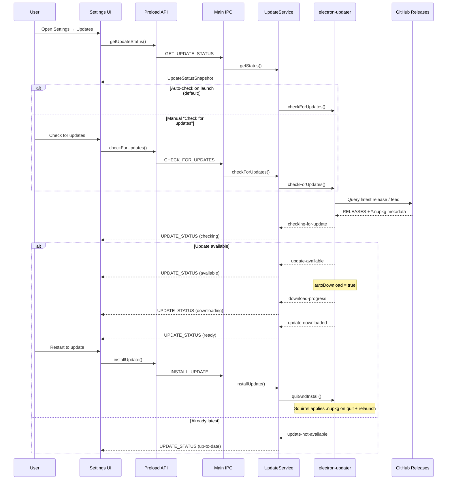

# Auto-update

How DiskScope checks for, downloads, and applies updates on Windows. This document covers the in-app flow, release artifacts, and operational checklists for maintainers and testers.

**Related docs**

- [Task 022 — Auto-update](tasks/022-auto-update.md) — implementation spec and acceptance criteria
- [Publishing and release](publishing-and-release.md) — how releases are built and uploaded to GitHub

---

## Summary

DiskScope uses **`electron-updater`** with the **GitHub provider** to discover new releases, download Squirrel update packages (`.nupkg`), and apply them when the user restarts. Update logic lives entirely in the **main process**; the renderer only sees a typed IPC API and status events.

| Build type | Auto-update |
| --- | --- |
| Squirrel installer (`DiskScope-*-Setup.exe`) | Yes |
| Portable zip (`DiskScope-*-win32-x64-portable.zip`) | No — reinstall manually from GitHub Releases |
| Dev mode (`pnpm dev`) | No — updater is disabled |

---

## End-to-end flow



---

## When the updater runs

The updater is **active only in packaged Squirrel installs**:

1. **`app.isPackaged`** must be `true` — dev and unpackaged runs never call `electron-updater`.
2. **Squirrel first-run hooks** must not be running — if `electron-squirrel-startup` handles install/update/uninstall, the app quits immediately and the update service is never initialized.

On normal startup (`src/main/main.ts`):

1. Preferences load.
2. Main window opens.
3. `initUpdateService().init()` runs (skipped during Squirrel install).
4. If `autoCheckForUpdates` is enabled (default **on**), a background check starts.

Manual checks from **Settings → Updates → Check for updates** always invoke the same `checkForUpdates()` path, regardless of the auto-check preference.

---

## Update state machine

`UpdateService` maps `electron-updater` events to a single `UpdateStatusSnapshot` shared with the renderer.

| Phase | Meaning | Typical user message |
| --- | --- | --- |
| `idle` | No check in progress | (none) or dev-mode notice |
| `checking` | Querying GitHub | "Checking for updates…" |
| `available` | Newer version found | "Update X is available. Downloading…" |
| `downloading` | `.nupkg` download in progress | "Downloading update… N%" |
| `ready` | Download complete, pending restart | "Update X is ready. Restart to install." |
| `up-to-date` | No newer release | "You are on the latest version." |
| `error` | Network, API, or feed failure | "Update check failed." + detail |

Status changes are **pushed** to all open windows via `IPC_CHANNELS.UPDATE_STATUS`. The Settings UI also polls once on mount with `getUpdateStatus()`.

### Backend configuration

When the backend is bound (`UpdateService.bindBackendEvents()`):

- **`autoDownload = true`** — download starts as soon as an update is available.
- **`autoInstallOnAppQuit = false`** — the user must explicitly choose **Restart to update** (calls `quitAndInstall(false, true)`).

Install is only allowed when `phase === 'ready'`.

---

## Architecture by layer

### Main process — `UpdateService`

**File:** `src/main/services/update-service.ts`

- Wraps `electron-updater`’s `autoUpdater` behind a testable `UpdateBackend` interface.
- Loads `autoUpdater` only when `app.isPackaged` (`createProductionUpdateBackend()`).
- Holds the canonical status snapshot and broadcasts patches to renderer windows.
- Respects `AppPreferences.autoCheckForUpdates` on `init()`.

### Main process — IPC

**File:** `src/main/ipc/update-ipc.ts`

| Channel | Direction | Purpose |
| --- | --- | --- |
| `disk-scope:check-for-updates` | invoke | Start a check |
| `disk-scope:get-update-status` | invoke | Read current snapshot |
| `disk-scope:install-update` | invoke | Quit and apply when `ready` |
| `disk-scope:update-status` | event | Push snapshot on every change |

Registered at startup in `src/main/main.ts` alongside other IPC handlers.

### Preload — typed renderer API

**File:** `src/preload/disk-scope-api.ts`

Exposes `window.diskScope.updates`:

```ts
checkForUpdates(): Promise<void>;
installUpdate(): Promise<void>;
getUpdateStatus(): Promise<UpdateStatusSnapshot>;
onUpdateStatus(callback): Unsubscribe;
```

No feed URLs, file paths, or raw updater objects cross the context bridge.

### Renderer — Settings UI

**File:** `src/renderer/features/settings/SettingsView.tsx` (`UpdatesCard`)

- Shows current version, status message, last-checked time, and errors.
- **Check for updates** — disabled while `checking` or `downloading`.
- **Restart to update** — visible only when `phase === 'ready'`.
- **Automatically check for updates** — toggle persisted via `setAutoCheckForUpdatesPreference()` (default on).

### Shared types

**File:** `src/shared/types.ts`

- `UpdatePhase`, `UpdateStatusSnapshot`, `UpdateAPI`
- `AppPreferences.autoCheckForUpdates`

---

## How GitHub Releases feed the updater

Configuration in `package.json`:

```json
"repository": {
  "type": "git",
  "url": "https://github.com/tmorse01/disk-scope.git"
},
"build": {
  "publish": [{
    "provider": "github",
    "owner": "tmorse01",
    "repo": "disk-scope"
  }]
}
```

`electron-updater` uses this to locate the GitHub repo and the latest release. Squirrel-installed apps consume the **Squirrel feed assets** attached to each release:

| Release asset | Role |
| --- | --- |
| `RELEASES` | Manifest listing available `.nupkg` versions |
| `*.nupkg` | Full update package (built by `@electron-forge/maker-squirrel`) |
| `DiskScope-<version>-Setup.exe` | Initial install only — not used for in-app delta/full update apply |

These files are produced by `pnpm make` under `out/make/squirrel.windows/x64/` and staged by [`scripts/stage-release-assets.ps1`](../scripts/stage-release-assets.ps1) for CI or local release upload. See [Auto-update assets](publishing-and-release.md#auto-update-assets) in the publishing guide.

**Important:** A release that only uploads the Setup exe and portable zip **will not** satisfy in-app updates. Every release must include `RELEASES` and at least one `.nupkg`.

---

## Maintainer checklist

### Publishing a version that supports auto-update

1. Pass the quality gate: `pnpm lint`, `pnpm typecheck`, `pnpm test`.
2. Bump `version` in `package.json` and commit.
3. Publish via CI (`pnpm release:ci`) or local (`pnpm release`) — see [Publishing and release](publishing-and-release.md).
4. On the GitHub Release page for `v<version>`, confirm:
   - `RELEASES`
   - `DiskScope-<version>-full.nupkg` (or equivalent `*.nupkg`)
   - `DiskScope-<version>-Setup.exe`
   - `SHA256SUMS.txt` (optional verification)

### Verifying auto-update works

1. Install an **older** Squirrel build (e.g. previous release’s Setup exe).
2. Publish a **newer** release with Squirrel feed assets.
3. In the old app: **Settings → Updates → Check for updates** (or relaunch with auto-check on).
4. Expect: checking → downloading → **Restart to update**.
5. After restart, **Settings → Updates** should show the new version as current.

Dev builds (`pnpm dev`) always show: *"Updates are checked in installed builds only."*

---

## Testing

### Automated

**File:** `tests/main/update-service.test.ts`

- Dev/disabled mode does not call the backend.
- Auto-check on `init()` when preference is enabled.
- Event → phase mapping and IPC broadcast.
- `installUpdate()` only calls `quitAndInstall` when `ready`.
- IPC handlers wire check, status, and install.

Run: `pnpm test` (or filter to `update-service`).

### Manual scenarios

| Scenario | Expected result |
| --- | --- |
| Packaged app, newer release on GitHub | Download progress, then **Restart to update** |
| Already on latest | "You are on the latest version." + `lastCheckedAt` |
| Auto-check disabled | No check on launch; manual check still works |
| Offline / GitHub error | `error` phase with message; app remains usable |
| Portable zip | No updater; Settings explains manual reinstall |
| Squirrel install/uninstall first run | App exits via `electron-squirrel-startup`; no update init |

---

## Troubleshooting

| Symptom | Likely cause | What to do |
| --- | --- | --- |
| "Updates are checked in installed builds only." | Running `pnpm dev` or unpackaged exe | Test with a Squirrel-installed packaged build |
| Check succeeds but never reaches **ready** | Release missing `RELEASES` or `.nupkg` | Re-run release staging; verify GitHub Release assets |
| Update check fails immediately | Wrong `repository` / `build.publish`, network, or rate limit | Confirm `package.json` GitHub config; retry later |
| Portable build never updates | By design | Download new Setup exe or portable zip from Releases |
| SmartScreen warnings | Unsigned builds (MVP) | Expected; code signing is a future follow-up |

---

## Scope and limitations

**In scope (v1)**

- Windows Squirrel-installed builds only
- GitHub Releases as the update source
- User-initiated restart to apply
- Auto-check on launch (preference, default on)

**Out of scope**

- Portable zip auto-update
- macOS / Linux (makers exist but auto-update is not implemented)
- Beta channels, staged rollouts, or downgrades
- In-app release notes viewer
- Code signing (reduces SmartScreen friction but not required for the mechanism to work)

---

## Key source files

| Area | Path |
| --- | --- |
| Update service | `src/main/services/update-service.ts` |
| IPC handlers | `src/main/ipc/update-ipc.ts` |
| App startup | `src/main/main.ts` |
| Preload API | `src/preload/disk-scope-api.ts` |
| Settings UI | `src/renderer/features/settings/SettingsView.tsx` |
| Types & IPC channels | `src/shared/types.ts`, `src/shared/ipc-channels.ts` |
| Preferences | `src/main/services/preferences-store.ts` |
| Release staging | `scripts/stage-release-assets.ps1` |
| Unit tests | `tests/main/update-service.test.ts` |
| Dependency | `electron-updater` in `package.json` (external in `vite.main.config.ts`) |
